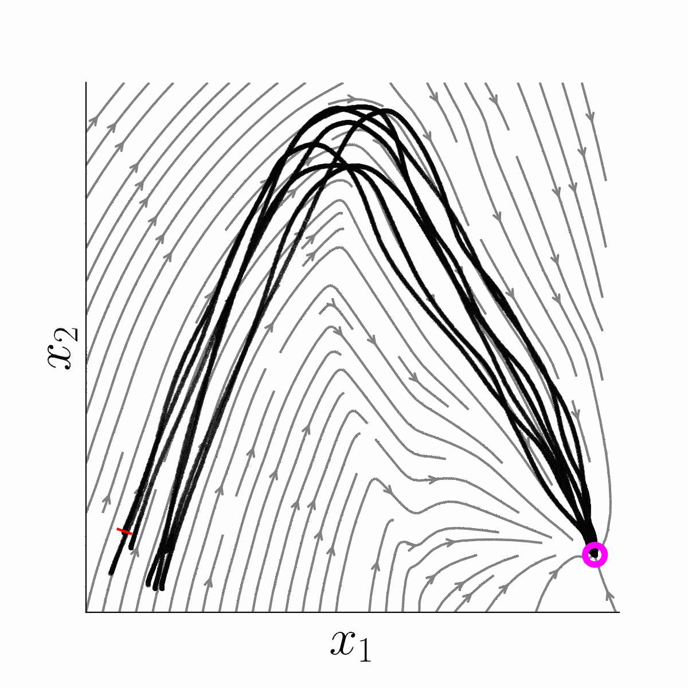
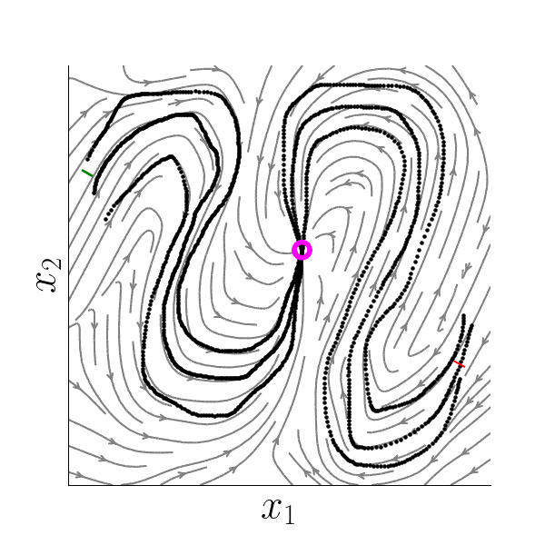

# Linear Parameter Varying Dynamical Systems (LPV-DS)

Boilerplate code for LPV-DS framework [1]. By default, one can pull the following modules: [DAMM](https://github.com/sunan-sun/damm) [2] and [ds-opt](https://github.com/sunan-sun/dsopt) [3] for immediate use. This code has also been integrated as a part of [SE(3) LPV-DS](https://github.com/sunan-sun/se3_lpvds) specifically for position planning and control. See below for running simulation on the learned dynamical systems.


<p align="center">
  
  
</p>


## Datasets
The datasets include [LASA handwriting dataset](https://github.com/justagist/pyLasaDataset) and [PC-GMM dataset](https://github.com/nbfigueroa/phys-gmm). One can change and choose the dataset in `main.py` following the instructions in comments. To test your own dataset, please examine and follow the data structure of the inputs in the example.

## Usage


### 1. Create a Virtual Environment

It is recommended to use a virtual environment with Python >= 3.9. You can create one using [conda](https://docs.conda.io/en/latest/):

```bash
conda create -n venv python=3.9
conda activate venv
```

### 2. Install Dependencies

Install the required Python packages:

```bash
pip install -r requirements.txt
vcs import . < dependency.yaml
```

### 3. Run the Code

Edit `main.py` to select your dataset and run:

```bash
python main.py
```


## References
If you find this code useful for you project, please consider citing the following.
> [1] Billard, A., Mirrazavi, S., & Figueroa, N. (2022). Learning for adaptive and reactive robot control: a dynamical systems approach. Mit Press.

> [2] Sun, S., Gao, H., Li, T., & Figueroa, N. (2024). "Directionality-aware mixture model parallel sampling for efficient linear parameter varying dynamical system learning". IEEE Robotics and Automation Letters, 9(7), 6248-6255.

> [3] Li, T., Sun, S., Aditya, S. S., & Figueroa, N. (2025). Elastic Motion Policy: An Adaptive Dynamical System for Robust and Efficient One-Shot Imitation Learning. arXiv preprint arXiv:2503.08029.


## Contact

Contact: [Sunan Sun](https://sunan-sun.github.io/) (sunan@seas.upenn.edu)
